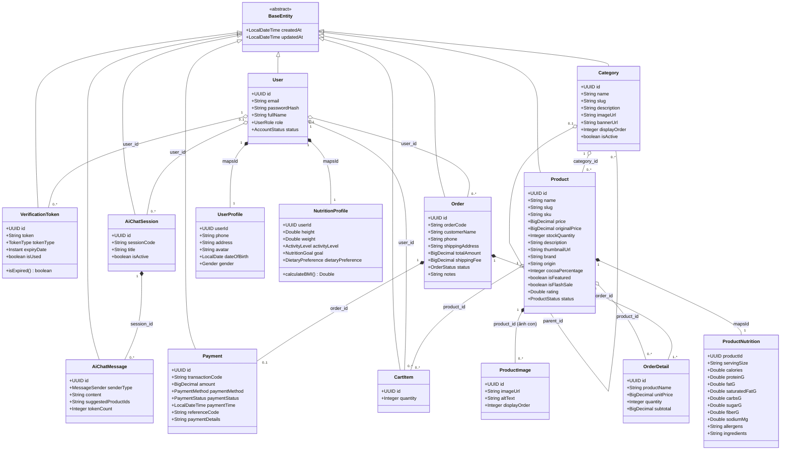

# Sơ đồ Lớp Thực thể Chi tiết (Entity Class Diagram) - The Sweet Lab

Tài liệu này đặc tả toàn bộ hệ thống lớp thực thể (JPA Entities & Enums) cho dự án **The Sweet Lab**, kết hợp giữa các module đã có (`auth`, `user`) và các module chuẩn bị triển khai (`product`, `order`, `nutrition`) bám sát [Data_Idea.md](file:///d:/HK9/WWW/Group_Report/Project/docs/Data_Idea.md).

---

## 1. Biểu đồ Mermaid Class Diagram Tổng thể



---

## 2. Đặc tả Chi tiết Từng Lớp Thực thể (Module Breakdown)

### 2.1. Module Base & Common (`com.thesweetlabbe.common`)

#### `BaseEntity` (Lớp trừu tượng cha)
- `@MappedSuperclass`, `@EntityListeners(AuditingEntityListener.class)`
- `createdAt`: `LocalDateTime` (Tự động gán thời điểm tạo).
- `updatedAt`: `LocalDateTime` (Tự động cập nhật khi sửa đổi).

---

### 2.2. Module User & Auth (`com.thesweetlabbe.modules.user & auth` - Đã có)

#### `User` (Bảng `users`)
- `id`: `UUID` (Primary Key).
- `email`: `String(150)` (Unique, Not Null).
- `passwordHash`: `String` (Bcrypt, `@JsonIgnore`).
- `fullName`: `String(100)` (Not Null).
- `role`: `UserRole` (`ROLE_CUSTOMER`, `ROLE_ADMIN`).
- `status`: `AccountStatus` (`PENDING_VERIFICATION`, `ACTIVE`, `SUSPENDED`, `DELETED`).
- **Quan hệ**:
  - `profile`: `UserProfile` (1-1, CascadeType.ALL).
  - `nutritionProfile`: `NutritionProfile` (1-1, CascadeType.ALL).

#### `UserProfile` (Bảng `user_profiles`)
- `userId`: `UUID` (`@MapsId` từ `User`).
- `phone`: `String(20)`.
- `address`: `String(255)`.
- `avatar`: `String(500)`.
- `dateOfBirth`: `LocalDate`.
- `gender`: `Gender` (`MALE`, `FEMALE`, `OTHER`).

#### `NutritionProfile` (Bảng `nutrition_profiles` - Phục vụ tính calo & AI)
- `userId`: `UUID` (`@MapsId` từ `User`).
- `height`: `Double` (cm, > 0).
- `weight`: `Double` (kg, > 0).
- `activityLevel`: `ActivityLevel` (`SEDENTARY`, `LIGHTLY_ACTIVE`, `MODERATELY_ACTIVE`, `VERY_ACTIVE`, `SUPER_ACTIVE`).
- `goal`: `NutritionGoal` (`WEIGHT_LOSS`, `MAINTAIN_WEIGHT`, `MUSCLE_GAIN`, `HEALTHY_SNACKING`, `DIABETES_CARE`).
- `dietaryPreference`: `DietaryPreference` (`NONE`, `KETO`, `VEGAN`, `LOW_CARB`, `GLUTEN_FREE`, `SUGAR_FREE`).

#### `VerificationToken` (Bảng `verification_tokens`)
- `id`: `UUID`.
- `token`: `String(100)` (Unique, Index).
- `user`: `User` (`@ManyToOne`).
- `tokenType`: `TokenType` (`EMAIL_VERIFICATION`, `PASSWORD_RESET`, `REFRESH_TOKEN`).
- `expiryDate`: `Instant`.
- `isUsed`: `boolean`.

---

### 2.3. Module Product & Category (`com.thesweetlabbe.modules.product` - Sắp tạo)

#### `Category` (Bảng `categories` - Cây phân cấp danh mục)
- `id`: `UUID` (Primary Key).
- `name`: `String(100)` (Not Null).
- `slug`: `String(120)` (Unique, Index).
- `description`: `String(500)`.
- `imageUrl`: `String(500)`.
- `bannerUrl`: `String(500)`.
- `parent`: `Category` (`@ManyToOne`, `joinColumn = "parent_id"` - Nullable: nếu null là danh mục gốc).
- `children`: `List<Category>` (`@OneToMany(mappedBy = "parent")`).
- `displayOrder`: `Integer` (Thứ tự hiển thị: 1, 2, 3...).
- `isActive`: `boolean` (Mặc định `true`).

#### `Product` (Bảng `products` - Sản phẩm Bán hàng Tinh gọn)
- `id`: `UUID` (Primary Key).
- `name`: `String(200)` (Not Null).
- `slug`: `String(220)` (Unique, Index).
- `sku`: `String(50)` (Mã sản phẩm, Unique).
- `price`: `BigDecimal` (Giá bán hiện tại, Not Null).
- `originalPrice`: `BigDecimal` (Giá gốc trước giảm giá).
- `stockQuantity`: `Integer` (Số lượng tồn kho, >= 0).
- `description`: `String` (`@Column(columnDefinition = "TEXT")`).
- `thumbnailUrl`: `String(500)` (Ảnh thumbnail chính đại diện cho sản phẩm).
- `category`: `Category` (`@ManyToOne`, Not Null).
- **Trường phục vụ Bộ lọc theo Data_Idea.md**:
  - `brand`: `String(100)` (Marou, Royce, Ferrero Rocher, KitKat, Handmade...).
  - `origin`: `String(100)` (Việt Nam, Bỉ, Pháp, Nhật, Mỹ...).
  - `cocoaPercentage`: `Integer` (Nullable: dành cho socola đen từ 50% - 100%).
  - `dietaryTags`: `Set<DietaryTag>` (`@ElementCollection` hoặc EnumSet: `SUGAR_FREE`, `VEGAN`, `ORGANIC`, `LOW_CARB`, `KETO`).
- **Trạng thái & Đánh giá**:
  - `isFeatured`: `boolean` (Hiển thị nổi bật trang chủ).
  - `isFlashSale`: `boolean` (Tham gia Flash Sale).
  - `rating`: `Double` (Trung bình số sao: 0.0 - 5.0).
  - `status`: `ProductStatus` (`ACTIVE`, `INACTIVE`, `OUT_OF_STOCK`).
- **Quan hệ**:
  - `nutrition`: `ProductNutrition` (`@OneToOne(mappedBy = "product", cascade = CascadeType.ALL, fetch = FetchType.LAZY)`).
  - `images`: `List<ProductImage>` (`@OneToMany(mappedBy = "product", cascade = CascadeType.ALL, orphanRemoval = true)` - Danh sách nhiều ảnh con/gallery).

#### `ProductNutrition` (Bảng `product_nutritions` - Chi tiết Dinh dưỡng & Thành phần cho AI & Chi tiết Sản phẩm)
> *Lợi ích kiến trúc: Giữ bảng `products` nhẹ, truy vấn danh sách/lọc cực nhanh; tách riêng bảng dinh dưỡng giúp AI dễ dàng lập chỉ mục (index) và tìm kiếm phạm vi calo/đường/protein theo nhu cầu sức khỏe mà không làm nghẽn bảng chính.*
- `productId`: `UUID` (`@Id`, `@MapsId` chia sẻ cùng ID với `Product`).
- `product`: `Product` (`@OneToOne`, `@JoinColumn(name = "product_id")`).
- `servingSize`: `String(50)` (Khẩu phần tham chiếu: ví dụ "100g", "1 thanh 40g", "2 viên").
- `calories`: `Double` (Kcal per serving/100g - đánh `@Index` để AI lọc calo nhanh).
- `proteinG`: `Double` (Lượng đạm tính bằng Gram).
- `fatG`: `Double` (Chất béo tổng).
- `saturatedFatG`: `Double` (Chất béo bão hòa).
- `carbsG`: `Double` (Carbohydrate tổng).
- `sugarG`: `Double` (Lượng đường - đánh `@Index` để lọc Keto/Ăn kiêng).
- `fiberG`: `Double` (Chất xơ).
- `sodiumMg`: `Double` (Hàm lượng muối Natri tính bằng mg).
- `allergens`: `String(255)` (Cảnh báo dị ứng: Đậu phộng, Gluten, Sữa bò...).
- `ingredients`: `String` (`@Column(columnDefinition = "TEXT")` - Danh sách nguyên liệu/thành phần).

#### `ProductImage` (Bảng `product_images` - Bộ sưu tập nhiều ảnh con của sản phẩm)
- `id`: `UUID` (Primary Key).
- `product`: `Product` (`@ManyToOne`, Not Null).
- `imageUrl`: `String(500)` (Đường dẫn ảnh chi tiết/ảnh góc chụp khác nhau).
- `altText`: `String(200)` (Văn bản thay thế SEO & mô tả góc ảnh).
- `displayOrder`: `Integer` (Thứ tự hiển thị trong slider ảnh: 1, 2, 3...).

---

### 2.4. Module Order, Cart & Payment (`com.thesweetlabbe.modules.order`)

#### `CartItem` (Bảng `cart_items` - Giỏ hàng đồng bộ cho User)
- `id`: `UUID`.
- `user`: `User` (`@ManyToOne`, Not Null).
- `product`: `Product` (`@ManyToOne`, Not Null).
- `quantity`: `Integer` (Not Null, > 0).

#### `Order` (Bảng `orders` - Đơn hàng)
- `id`: `UUID`.
- `orderCode`: `String(50)` (Mã đơn hàng sinh tự động: e.g. `SWL-20260913-9821`, Unique, Index).
- `user`: `User` (`@ManyToOne`, Nullable nếu cho phép Guest mua hàng).
- `customerName`: `String(100)` (Not Null).
- `phone`: `String(20)` (Not Null).
- `shippingAddress`: `String(255)` (Not Null).
- `totalAmount`: `BigDecimal` (Tổng tiền hàng, Not Null).
- `shippingFee`: `BigDecimal` (Phí vận chuyển).
- `status`: `OrderStatus` (`PENDING`, `CONFIRMED`, `SHIPPING`, `DELIVERED`, `CANCELLED`).
- `notes`: `String(500)` (Ghi chú giao hàng).
- **Quan hệ**:
  - `items`: `List<OrderDetail>` (`@OneToMany(mappedBy = "order", cascade = CascadeType.ALL)`).
  - `payment`: `Payment` (`@OneToOne(mappedBy = "order", cascade = CascadeType.ALL)`).

#### `OrderDetail` (Bảng `order_details` - Chi tiết từng món trong đơn)
- `id`: `UUID`.
- `order`: `Order` (`@ManyToOne`, Not Null).
- `product`: `Product` (`@ManyToOne`, Not Null).
- `productName`: `String(200)` (Lưu snapshot tên sản phẩm tại thời điểm mua).
- `unitPrice`: `BigDecimal` (Lưu snapshot đơn giá tại thời điểm mua).
- `quantity`: `Integer` (Số lượng mua).
- `subtotal`: `BigDecimal` (`unitPrice * quantity`).

#### `Payment` (Bảng `payments` - Giao dịch Thanh toán cho Đơn hàng)
> *Tách riêng thực thể Payment giúp chuẩn hóa việc theo dõi thanh toán (COD, VietQR, Chuyển khoản, VNPay...), lưu lịch sử giao dịch và đối soát độc lập với trạng thái vận chuyển của Order.*
- `id`: `UUID` (Primary Key).
- `order`: `Order` (`@OneToOne`, `@JoinColumn(name = "order_id")`, Not Null).
- `transactionCode`: `String(100)` (Mã giao dịch từ ngân hàng / VietQR / cổng thanh toán, Unique, Index).
- `amount`: `BigDecimal` (Số tiền thực tế thanh toán).
- `paymentMethod`: `PaymentMethod` (`COD`, `BANK_TRANSFER_VIETQR`, `VNPAY`, `MOMO`).
- `paymentStatus`: `PaymentStatus` (`PENDING`, `SUCCESS`, `FAILED`, `REFUNDED`).
- `paymentTime`: `LocalDateTime` (Thời điểm hoàn tất thanh toán).
- `referenceCode`: `String(100)` (Mã tham chiếu thanh toán chuyển khoản).
- `paymentDetails`: `String` (`@Column(columnDefinition = "TEXT")` - Dữ liệu webhook/phản hồi kỹ thuật từ cổng thanh toán).

---

### 2.5. Module AI Nutrition Chat (`com.thesweetlabbe.modules.nutrition`)

#### `AiChatSession` (Bảng `ai_chat_sessions` - Quản lý Phiên trò chuyện với AI)
> *Lưu vết các phiên tư vấn sức khỏe của người dùng hoặc khách vãng lai, cho phép tiếp tục đoạn hội thoại hoặc xem lại lịch sử tư vấn.*
- `id`: `UUID` (Primary Key).
- `user`: `User` (`@ManyToOne`, Nullable - hỗ trợ cả khách vãng lai qua sessionCode).
- `sessionCode`: `String(100)` (Mã định danh phiên, Unique, Index).
- `title`: `String(200)` (Tiêu đề tóm tắt cuộc hội thoại, tự động sinh từ câu hỏi đầu tiên).
- `isActive`: `boolean` (Trạng thái phiên chat còn hiệu lực hay đã đóng).
- **Quan hệ**:
  - `messages`: `List<AiChatMessage>` (`@OneToMany(mappedBy = "session", cascade = CascadeType.ALL)`).

#### `AiChatMessage` (Bảng `ai_chat_messages` - Từng tin nhắn hỏi/đáp trong phiên chat)
- `id`: `UUID` (Primary Key).
- `session`: `AiChatSession` (`@ManyToOne`, Not Null).
- `senderType`: `MessageSender` (`USER`, `ASSISTANT`, `SYSTEM`).
- `content`: `String` (`@Column(columnDefinition = "TEXT")` - Nội dung câu hỏi của khách hoặc phân tích dinh dưỡng của AI).
- `suggestedProductIds`: `String(500)` (Danh sách UUID sản phẩm được AI đề xuất - định dạng JSON/CSV để giao diện hiển thị ngay card mua nhanh).
- `tokenCount`: `Integer` (Số lượng token AI đã sử dụng để đo lường/kiểm soát chi phí API).

---

## 3. Bảng Tổng hợp Enum Hệ thống

| Tên Enum | Giá trị hỗ trợ | Ý nghĩa nghiệp vụ |
| :--- | :--- | :--- |
| `UserRole` | `ROLE_CUSTOMER`, `ROLE_ADMIN` | Phân quyền tài khoản |
| `AccountStatus` | `PENDING_VERIFICATION`, `ACTIVE`, `SUSPENDED`, `DELETED` | Trạng thái kích hoạt tài khoản |
| `Gender` | `MALE`, `FEMALE`, `OTHER` | Giới tính trong Profile |
| `ActivityLevel` | `SEDENTARY`, `LIGHTLY_ACTIVE`, `MODERATELY_ACTIVE`, `VERY_ACTIVE`, `SUPER_ACTIVE` | Mức độ vận động (tính TDEE/Calo) |
| `NutritionGoal` | `WEIGHT_LOSS`, `MAINTAIN_WEIGHT`, `MUSCLE_GAIN`, `HEALTHY_SNACKING`, `DIABETES_CARE` | Mục tiêu sức khỏe (phục vụ AI tư vấn) |
| `DietaryPreference` | `NONE`, `KETO`, `VEGAN`, `LOW_CARB`, `GLUTEN_FREE`, `SUGAR_FREE` | Thói quen ăn kiêng cá nhân |
| `DietaryTag` | `SUGAR_FREE`, `VEGAN`, `ORGANIC`, `LOW_CARB`, `KETO` | Nhãn ăn kiêng gắn trên từng sản phẩm |
| `ProductStatus` | `ACTIVE`, `INACTIVE`, `OUT_OF_STOCK` | Trạng thái bày bán sản phẩm |
| `OrderStatus` | `PENDING`, `CONFIRMED`, `SHIPPING`, `DELIVERED`, `CANCELLED` | Vòng đời đơn hàng |
| `PaymentMethod` | `COD`, `BANK_TRANSFER_VIETQR`, `VNPAY`, `MOMO` | Phương thức thanh toán |
| `PaymentStatus` | `PENDING`, `SUCCESS`, `FAILED`, `REFUNDED` | Trạng thái thanh toán |
| `MessageSender` | `USER`, `ASSISTANT`, `SYSTEM` | Phân loại người gửi trong phiên chat AI |

---

## 4. Quy tắc Nghiệp vụ Ràng Buộc Xóa (Data Integrity - Không dùng CASCADE ở DB)

Theo yêu cầu chuẩn mực của đề tài và barem chấm điểm, các ràng buộc toàn vẹn sẽ được đảm bảo thông qua tầng Service bằng phương thức kiểm tra số đếm (`count`):

1. **Xóa Category (`deleteCategory(UUID id)`)**:
   ```java
   long productCount = productRepository.countByCategoryId(id);
   long childCategoryCount = categoryRepository.countByParentId(id);
   if (productCount > 0 || childCategoryCount > 0) {
       throw new AppException(ErrorCode.CATEGORY_CANNOT_BE_DELETED);
   }
   ```
2. **Xóa Product (`deleteProduct(UUID id)`)**:
   ```java
   long orderDetailCount = orderDetailRepository.countByProductId(id);
   if (orderDetailCount > 0) {
       throw new AppException(ErrorCode.PRODUCT_CANNOT_BE_DELETED_HAS_ORDERS);
   }
   ```
3. **Xóa User (`deleteUser(UUID id)`)**:
   ```java
   long orderCount = orderRepository.countByUserId(id);
   if (orderCount > 0) {
       throw new AppException(ErrorCode.USER_CANNOT_BE_DELETED_HAS_ORDERS);
   }
   ```
