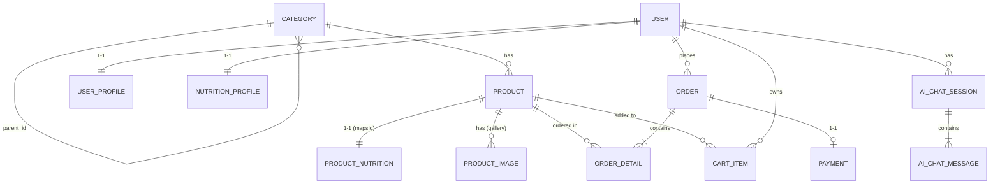

# Kế hoạch Tổng thể & Lộ trình Hoàn thiện Dự án "The Sweet Lab" (Kế hoạch v1)

Dự án **The Sweet Lab** là sàn thương mại điện tử chuyên biệt về **Đồ ăn vặt Healthy / Socola & Bánh kẹo dinh dưỡng**, kết hợp tính năng **Tư vấn Dinh dưỡng & Gợi ý Thông minh bằng AI**. 

Hiện tại, dự án đã có:
- **Backend (Spring Boot 3.3.5 / Java 21)**: Đã hoàn thiện kiến trúc Base Project theo chuẩn Modular Monolith, hạ tầng Docker (PostgreSQL 16, Redis 7, Mailpit), cùng module `auth` (Đăng ký, kích hoạt email HTML, đăng nhập JWT, refresh token) và `user` (`User`, `UserProfile`, `NutritionProfile`).
- **Frontend (Next.js 16 / React 19 / Tailwind v4)**: Đã xây dựng trang chủ mẫu (`HomePage`) với Mock data và các components: HeroSection, CategoryGrid, FlashSale, ProductSuggestion, PromoSection, Navbar, Footer.

Tài liệu này chuẩn hóa toàn bộ yêu cầu từ [Data_Idea.md](file:///d:/HK9/WWW/Group_Report/Project/docs/Data_Idea.md) thành **Kế hoạch triển khai chuẩn chỉnh 4 giai đoạn**, tích hợp chặt chẽ giữa Backend, Database, Frontend và Module AI.

---

## 1. Các điểm cốt lõi về Kiến trúc & Nghiệp vụ

### 1.1. Cơ chế Giỏ hàng (Cart State)
- **Khách vãng lai (Guest)**: Quản lý giỏ hàng ở Client (`localStorage` / state management) để mang lại trải nghiệm mượt mà, tốc độ phản hồi tức thì.
- **Khách hàng đã đăng nhập (Customer)**: Lưu và đồng bộ giỏ hàng với Backend qua Database / Redis (`POST /api/v1/cart/items`), tự động gộp (merge) giỏ hàng của khách vãng lai khi đăng nhập thành công.

### 1.2. Quy tắc Ràng buộc Xóa (Delete Integrity Rule - Tuân thủ Barem Chấm điểm)
- Tuyệt đối **không dùng `ON DELETE CASCADE`** trong cấu hình quan hệ Database cho Category, Product, User, Order.
- Toàn bộ logic kiểm tra ràng buộc trước khi xóa phải thực hiện chủ động ở tầng **Spring Boot Service** thông qua các phương thức đếm (count):
  - Khi xóa Category: Kiểm tra `productRepository.countByCategoryId(id) == 0` và không có danh mục con phụ thuộc.
  - Khi xóa Product: Kiểm tra `orderDetailRepository.countByProductId(id) == 0`.
  - Khi xóa User: Kiểm tra `orderRepository.countByUserId(id) == 0`.
- Nếu vi phạm ràng buộc, hệ thống ném ra Business Exception kèm mã lỗi HTTP `400 Bad Request` và thông điệp giải thích rõ ràng.

---

## 2. Thiết kế Cơ sở Dữ liệu & Cấu trúc Thực thể (Compact Schema)

Theo định hướng [Data_Idea.md](file:///d:/HK9/WWW/Group_Report/Project/docs/Data_Idea.md) và tích hợp các chỉ số dinh dưỡng phục vụ AI:



### Các bảng dữ liệu cốt lõi:
1. **`categories`**:
   - `id` (UUID / Long), `name`, `slug` (Unique), `description`, `image_url`, `banner_url`, `parent_id` (Cây danh mục 2 cấp), `display_order`, `is_active`.
2. **`products`** (Bảng sản phẩm tinh gọn):
   - `id` (UUID), `name`, `slug` (Unique), `sku`, `price`, `original_price`, `stockQuantity`, `description`, `thumbnail_url` (ảnh thumbnail chính), `brand`, `origin`, `dietary_tags`, `cocoa_percentage`, `is_featured`, `is_flash_sale`, `rating`, `status`.
3. **`product_nutritions`** (Tách riêng tối ưu hiệu năng và tra cứu dinh dưỡng cho AI):
   - `product_id` (UUID - PK/FK MapsId), `serving_size`, `calories` (Index), `protein_g`, `fat_g`, `saturated_fat_g`, `carbs_g`, `sugar_g` (Index), `fiber_g`, `sodium_mg`, `allergens`, `ingredients` (TEXT).
4. **`product_images`** (Thư viện nhiều ảnh con của sản phẩm):
   - `id`, `product_id`, `image_url`, `alt_text`, `display_order`.
5. **`cart_items`**:
   - `id`, `user_id`, `product_id`, `quantity`, `created_at`, `updated_at`.
6. **`orders`**:
   - `id` (UUID), `order_code` (e.g. `SWL-2026-XXXXX`), `user_id`, `customer_name`, `phone`, `shipping_address`, `total_amount`, `shipping_fee`, `status`, `notes`.
7. **`order_details`**:
   - `id`, `order_id`, `product_id`, `product_name`, `unit_price`, `quantity`, `subtotal`.
8. **`payments`** (Giao dịch thanh toán độc lập cho đơn hàng):
   - `id`, `order_id` (1-1), `transaction_code`, `amount`, `payment_method` (COD, BANK_TRANSFER_VIETQR, VNPAY...), `payment_status` (PENDING, SUCCESS, FAILED), `payment_time`, `reference_code`, `payment_details`.
9. **`ai_chat_sessions` & `ai_chat_messages`** (Lưu trữ các phiên tư vấn sức khỏe & gợi ý thông minh):
   - `ai_chat_sessions`: `id`, `user_id` (nullable), `session_code`, `title`, `is_active`.
   - `ai_chat_messages`: `id`, `session_id`, `sender_type` (USER, ASSISTANT, SYSTEM), `content`, `suggested_product_ids`, `token_count`.

---

## 3. Lộ trình Triển khai Chi tiết theo 4 Giai đoạn

### Giai đoạn 1: Hoàn thiện Module Product, Category & Bộ lọc Dữ liệu Đa Tiêu Chí
> **Mục tiêu**: Xây dựng kho dữ liệu sản phẩm bánh kẹo healthy hoàn chỉnh, API tra cứu đa tiêu chí và giao diện danh sách/chi tiết sản phẩm sống động.

- **Backend**:
  - Triển khai Entity: `Category`, `Product`, `ProductImage` trong `modules/product`.
  - Triển khai `ProductSpecification` (Spring Data JPA) hỗ trợ bộ lọc linh hoạt:
    - Danh mục & Danh mục con (`categoryId` / `categorySlug`).
    - Khoảng giá: Dưới 100k, 100k - 300k, 300k - 500k, Trên 500k.
    - Thương hiệu (`brand`), Nguồn gốc xuất xứ (`origin`).
    - Chế độ ăn uống (`dietaryTags`: Không đường, Thuần chay, Hữu cơ, Low-carb, Keto).
    - Tỉ lệ % Cacao (`cocoaPercentage`: 50-70%, 70-85%, >85%).
    - Sắp xếp (Giá tăng/giảm, Phổ biến, Mới nhất, Đánh giá cao).
  - API Controller:
    - `GET /api/v1/categories`: Lấy cây danh mục 4 nhóm chính và 14 nhóm con.
    - `GET /api/v1/products`: Tìm kiếm, phân trang và áp dụng bộ lọc.
    - `GET /api/v1/products/{idOrSlug}`: Xem chi tiết sản phẩm và các sản phẩm tương tự.
  - Viết `DataInitializer`: Nạp sẵn cây danh mục chuẩn và 20-30 sản phẩm healthy mẫu kèm ảnh, tag và thông số calo/dinh dưỡng.
- **Frontend**:
  - Chuyển `productService.ts` từ mock data sang kết nối API Backend thực tế.
  - Xây dựng trang Danh sách sản phẩm (`/products`):
    - Sidebar / Drawer chứa đầy đủ nhóm bộ lọc theo đúng thiết kế trong `Data_Idea.md`.
    - Thanh điều hướng Breadcrumb, sắp xếp linh hoạt, phân trang mượt mà.
  - Xây dựng trang Chi tiết sản phẩm (`/products/[slug]`):
    - Bộ sưu tập ảnh sản phẩm, chọn số lượng, nút thêm vào giỏ.
    - Bảng thông số Dinh Dưỡng & Calo chi tiết - nét đặc trưng của sản phẩm Healthy.

---

### Giai đoạn 2: Giỏ hàng, Đặt hàng & Thanh toán (Cart & Checkout Flow)
> **Mục tiêu**: Khép kín toàn bộ luồng mua sắm của Khách hàng, gửi email xác nhận đơn tự động và quản lý đơn hàng cá nhân.

- **Backend**:
  - Triển khai Entity: `CartItem`, `Order`, `OrderDetail` trong `modules/order`.
  - `CartService`: Quản lý thêm/sửa/xóa giỏ hàng của Customer, cơ chế gộp giỏ hàng (merge cart).
  - `OrderService`:
    - Tạo đơn hàng: Kiểm tra số lượng tồn kho `stock_quantity`, trừ kho an toàn.
    - Tạo mã đơn hàng chuẩn định dạng `SWL-...`.
    - Tự động gửi Email HTML xác nhận đơn hàng qua Spring Mail + Thymeleaf template (chi tiết danh sách món, tổng tiền, địa chỉ giao).
    - Clear giỏ hàng sau khi đặt thành công.
    - `GET /api/v1/orders/my-orders`: Lịch sử đơn hàng của người dùng.
- **Frontend**:
  - Mini Cart Dropdown ở thanh Header + Trang giỏ hàng đầy đủ (`/cart`).
  - Trang Đặt hàng & Thanh toán (`/checkout`): Nhập thông tin người nhận, chọn COD hoặc Chuyển khoản ngân hàng (hiển thị VietQR thanh toán).
  - Trang Thông báo đặt hàng thành công (`/checkout/success?orderCode=...`).
  - Trang Theo dõi đơn hàng cá nhân (`/profile/orders`).

---

### Giai đoạn 3: Phân hệ Quản trị (Admin Portal) & Ràng buộc Nghiệp vụ
> **Mục tiêu**: Cung cấp bộ công cụ quản trị hoàn chỉnh cho Admin với đầy đủ kiểm tra ràng buộc nghiệp vụ.

- **Backend**:
  - Phân quyền chặt chẽ với `@PreAuthorize("hasRole('ADMIN')")`.
  - CRUD Category: `POST/PUT/DELETE /api/v1/admin/categories` (kiểm tra không cho xóa nếu còn sản phẩm hoặc danh mục con).
  - CRUD Product: `POST/PUT/DELETE /api/v1/admin/products` (kiểm tra không cho xóa nếu sản phẩm đã phát sinh đơn hàng).
  - CRUD User: `GET/PUT/DELETE /api/v1/admin/users` (không xem password hash, không cho xóa khách hàng đã từng đặt hàng).
  - Quản lý Order: Xem danh sách đơn hàng theo ngày/trạng thái, cập nhật trạng thái đơn (PENDING -> CONFIRMED -> SHIPPING -> DELIVERED).
  - Báo cáo thống kê: Doanh thu, số lượng đơn, cảnh báo sản phẩm sắp hết hàng trong kho.
- **Frontend**:
  - Khu vực Admin Portal (`/admin/*`) với giao diện chuyên nghiệp:
    - `/admin/dashboard`: Biểu đồ doanh thu, thống kê đơn hàng, sản phẩm bán chạy.
    - `/admin/products`: Danh sách sản phẩm, bộ lọc, form thêm/sửa sản phẩm.
    - `/admin/categories`: Quản lý cây danh mục cha/con.
    - `/admin/orders`: Quản lý và xử lý trạng thái đơn hàng.
    - `/admin/users`: Quản lý danh sách người dùng và phân quyền.

---

### Giai đoạn 4: Tích hợp Module AI (Trợ lý Dinh dưỡng & Gợi ý Thông minh)
> **Mục tiêu**: Tạo điểm nhấn công nghệ đột phá cho The Sweet Lab với AI tư vấn dinh dưỡng cá nhân hóa.

- **Backend**:
  - Tích hợp **Google Gemini API** qua Spring AI / REST Client.
  - `AiNutritionService`:
    - RAG (Retrieval-Augmented Generation) mini: Nạp ngữ cảnh danh mục và dữ liệu sản phẩm lành mạnh từ DB (calo, thành phần, tags dinh dưỡng).
    - Prompt đóng vai **Chuyên gia Dinh dưỡng của The Sweet Lab**:
      - Phân tích nhu cầu sức khỏe của khách (Tập gym tăng cơ, Giảm cân, Chế độ Keto, Ăn kiêng tiểu đường, Eat Clean...).
      - Đọc thông tin `NutritionProfile` của user (nếu đã đăng nhập: chiều cao, cân nặng, mục tiêu) để tính toán calo và gợi ý chính xác sản phẩm phù hợp đang bán kèm link.
  - `POST /api/v1/ai/chat`: Endpoint giao tiếp hỏi đáp dinh dưỡng với AI.
- **Frontend**:
  - Widget Chatbot AI dạng Floating Bubble ở góc màn hình (hiện đại, tương tác mượt mà).
  - Smart Recommender Carousel: Gợi ý sản phẩm kèm theo trong Giỏ hàng ("Mẹo lành mạnh: Mua kèm Socola 85% với Bánh Biscotti để cân bằng năng lượng").
  - Trang Cá nhân hóa Dinh dưỡng (`/profile/nutrition`): Người dùng cập nhật chỉ số BMI và mục tiêu để nhận gợi ý thực đơn ăn vặt healthy cá nhân.

---

## 4. Kế hoạch Kiểm thử & Đảm bảo Chất lượng (Verification)

### 4.1. Kiểm thử Tự động (Automated Tests)
- **Backend Tests**:
  - `ProductServiceTest`: Kiểm tra bộ lọc đa tiêu chí và quy tắc chặn xóa khi có ràng buộc khóa ngoại.
  - `OrderServiceTest`: Kiểm tra luồng tính tổng tiền, trừ tồn kho và gửi email bất đồng bộ.
  - Lệnh thực thi:
    ```bash
    cd the-sweet-lab-be
    ./mvnw test
    ```
- **Frontend Build**:
  - Kiểm tra tính tương thích TypeScript, ESLint và Next.js build:
    ```bash
    cd the-sweet-lab-fe
    npm run build
    ```

### 4.2. Kịch bản Kiểm thử Thủ công (Manual Test Flow)
1. **Kiểm tra hạ tầng**: Docker compose (`sweet_lab_postgres`, `sweet_lab_redis`, `sweet_lab_mailpit`) hoạt động ổn định.
2. **Khởi chạy Backend**: Xác nhận nạp thành công Data Seeder (Danh mục & Sản phẩm mẫu) trên Swagger UI.
3. **Duyệt sản phẩm Frontend**: Thao tác tìm kiếm, chọn lọc theo Giá, Chế độ ăn (Keto/Vegan), % Cacao.
4. **Luồng mua sắm**: Thêm vào giỏ -> Thanh toán -> Kiểm tra email xác nhận đơn hàng nhận được tức thì trong Mailpit Web UI (`http://localhost:8025`).
5. **Quyền Admin**: Đăng nhập tài khoản Admin, thử xóa sản phẩm đã có đơn hàng để kiểm tra thông báo chặn xóa đúng chuẩn.
6. **AI Nutrition Assistant**: Mở chatbot hỏi câu hỏi dinh dưỡng ("Tôi đang tập gym nên ăn loại bánh nào?") -> AI trả lời phân tích và đưa ra link sản phẩm chính xác.
